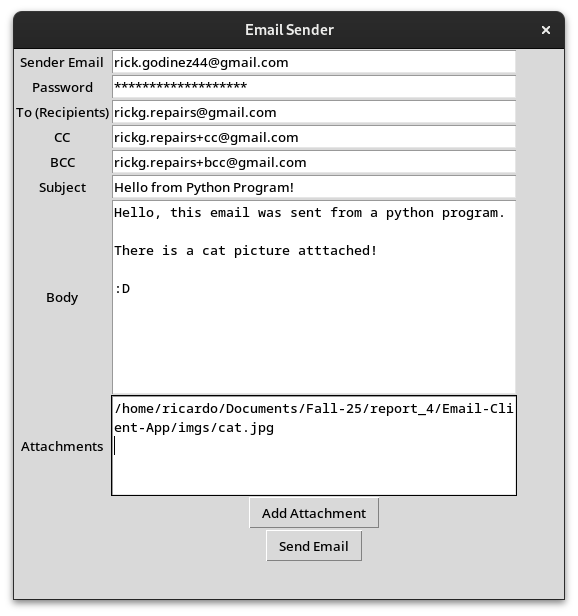
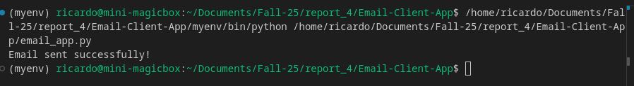
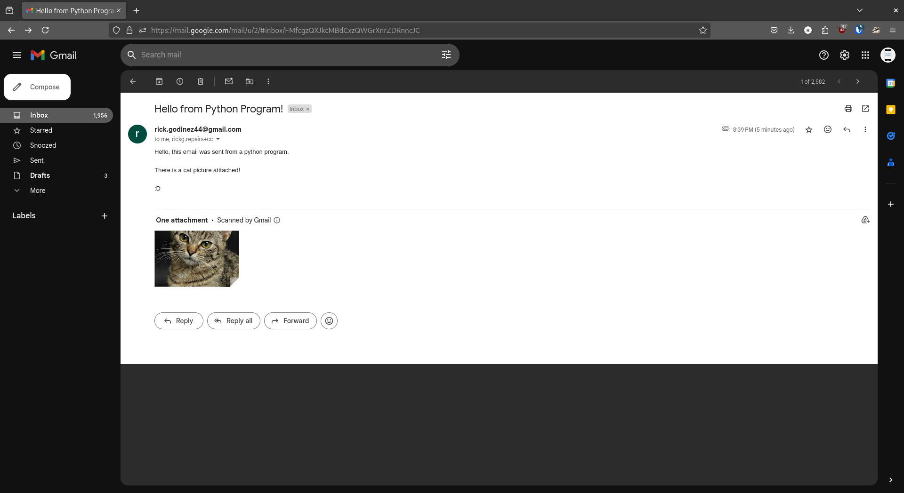

# Email-Client-App

A Python-based email client application with a graphical user interface (GUI) using `Tkinter`, designed for sending emails with support for CC, BCC, and file attachments.

*An example of the email client’s user interface.*


*Screenshot of terminal output"


*Screenshot of email that was sent*


## Features
- Send emails to multiple recipients.
- Include CC and BCC fields.
- Attach multiple files.
- User-friendly GUI built with `Tkinter`.
- Works with popular email providers (Gmail, Yahoo, etc.).

## Requirements
- Python 3.x
- Required Python Libraries:
  - `smtplib`
  - `email`
  - `tkinter`
  - `os`

## Installation
```bash
git clone https://github.com/r-godinez/Email-Client-App.git

cd Email-Client-App

pip install tk
or
source myenv/bin/activate

python email_app.py

```